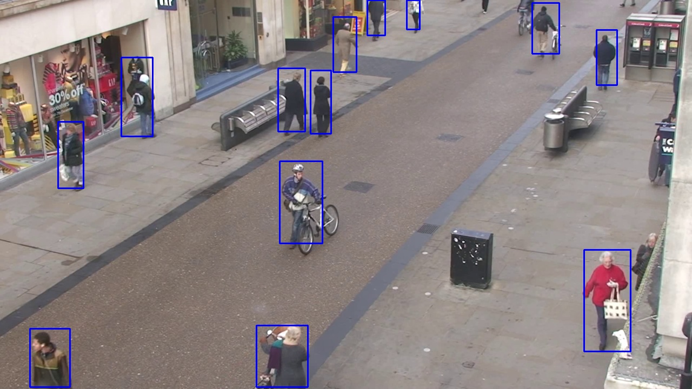

# About the Project

**This project was taken under [Prof. J.Jennifer Ranjani](https://www.bits-pilani.ac.in/pilani/jenniferranjani/profile), CSIS Department, BITS Pilani.**

With technological advancement in society, security systems have become an important aid for us. CCTV cameras are becoming more and more popular and being deployed in high security and regulatory areas. While security systems at public places of utmost importance like airports and railway stations have proven themselves to be robust with high detection rates for potentially harmful objects in the luggage via thermal and infrared imaging, they perform poorly on the concealed objects. In recent years, deep learning models have worked excellently in providing efficient and faster solutions to real-time detection of objects in image and video data with high accuracy rates. 

We intend to provide a review of various state-of-the-art algorithms in the broad domain of Computer Vision and compare them on the basis of their results on the COCO dataset for images and TownCentre and VIRAT dataset for pedestrian detection in videos.

##### **Problem Statement:**

Given the real-time data from CCTV and other security systems at public places, detect and segment all the humans in the video data with high sensitivity. We consider video as a series of frames and model this as a Human Detection and Segmentation Problem in Images.

We have done a comparative analysis of three algorithms:
1. Mask R-CNN
2. Faster R-CNN
3. Pose2Seg

and drawn the following **conclusion**

With COCO, TownCentre, and VIRAT dataset, we analyzed three popular algorithms in the domain of object detection. We achieved high accuracy using Faster R-CNN, however, the output suffers from jittering and merger of two very close windows. Mask R-CNN proves to be a robust algorithm taking an average of 0.2s testing time. However, it works poorly on highly occluded data. Pose2Seg takes a reverse bottom-up strategy for human detection via pose estimation. While Pose2Seg works best with the data, it takes a comparatively longer time (on the order of 2s). Thus, in cases of high occlusion as in our problem, Pose2Seg proves to be the best model.

A detailed report on the methodlogy followed and results obtained can be found [here](../docs/human detection.pdf)

# References

1. A Large-scale Benchmark Dataset for Event Recognition in Surveillance Video" by Sangmin Oh, Anthony Hoogs, Amitha Perera, Naresh Cuntoor, Chia-Chih Chen, Jong Taek Lee, Saurajit Mukherjee, J.K. Aggarwal, Hyungtae Lee, Larry Davis, Eran Swears, Xiaoyang Wang, Qiang Ji, Kishore Reddy, Mubarak Shah, Carl Vondrick, Hamed Pirsiavash, Deva Ramanan, Jenny Yuen, Antonio Torralba, Bi Song, Anesco Fong, Amit Roy-Chowdhury, and Mita Desai, in Proceedings of IEEE Computer Vision and Pattern Recognition (CVPR), 2011.
2. Cao, Zhe, et al. "OpenPose: realtime multi-person 2D pose estimation using Part Affinity Fields." arXiv preprint arXiv:1812.08008 (2018).
3. He, Kaiming, et al. "Mask r-cnn." Proceedings of the IEEE international conference on computer vision. 2017.
Lin, Tsung-Yi, et al. "Microsoft coco: Common objects in context." European conference on computer vision. Springer, Cham, 2014.
4. Ren, Shaoqing, et al. "Faster r-cnn: Towards real-time object detection with region proposal networks." Advances in neural information processing systems. 2015.
5. Zhang, Song-Hai, et al. "Pose2seg: detection free human instance segmentation." Proceedings of the IEEE conference on computer vision and pattern recognition. 2019.
